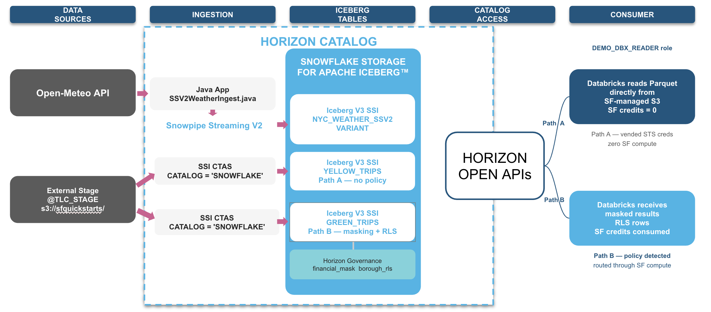

# Snowflake + Iceberg Interoperability Quickstart

Build Snowflake-managed Iceberg tables, stream live data via Snowpipe Streaming V2, and read from Databricks through Snowflake's Horizon Iceberg REST Catalog — with governance enforced across engine boundaries.

## What You Will Build

- **Snowflake-managed Iceberg tables** — 40M+ NYC taxi trips and weather data stored as open Apache Iceberg (Parquet + metadata), managed entirely by Snowflake with zero bucket configuration
- **Real-time streaming ingest** — A Java application that calls the Open-Meteo weather API and streams rows into an Iceberg V3 VARIANT table via Snowpipe Streaming V2 (SSV2)
- **Multi-engine reads from Databricks** — Databricks reads the same Iceberg tables through Snowflake's Horizon Iceberg REST Catalog (IRC) endpoint
- **Governance across engine boundaries** — Column masking and row-level security (RLS) policies applied in Snowflake are enforced when Databricks reads via Horizon
- **Iceberg V3 VARIANT** — Semi-structured JSON data stored natively in Iceberg V3 format and queried from both Snowflake (dot notation) and Spark 4.0 (`variant_get`)

### Architecture



## Prerequisites

| Requirement | Details |
|---|---|
| Snowflake account | Enterprise edition or higher (governance features require Enterprise+) |
| Snowflake role | ACCOUNTADMIN or a role with equivalent privileges |
| Databricks workspace | With access to create clusters (DBR 17.3, Spark 4.0) |
| Java JDK | Version 11 or higher — verify: `java -version` |
| Apache Maven | Version 3.6 or higher — verify: `mvn -version` |
| OpenSSL | For RSA key pair generation — verify: `openssl version` |

## Setup

### Authentication Overview

This quickstart uses **two** authentication methods. Understanding why avoids confusion later:

| Auth Method | Used By | Why |
|---|---|---|
| **PAT** (Programmatic Access Token) | Horizon IRC catalog credential (Databricks SparkSession) | The Iceberg REST Catalog spec uses OAuth bearer tokens. A PAT serves as that bearer token. |
| **RSA key-pair** | Spark Connector JDBC fallback (Databricks `spark.snowflake.*` config) | Path B tables (with masking/RLS) are routed through JDBC. JDBC does **not** accept PATs — key-pair auth is required. |
| **RSA key-pair** | Java SSV2 ingest app (`ssv2-streaming/profile.json`) | The Snowpipe Streaming SDK authenticates via key-pair, not PAT. |

**In short:** PAT handles catalog-level access (discovering and listing tables). Key-pair handles compute-level access (JDBC queries and streaming ingest).

You will set up the RSA key pair first (Step 1 below), then create the PAT later in Module 3.

### 1. Generate an RSA Key Pair

The RSA key pair is used by both the Spark Connector (Path B governance routing) and the Java SSV2 ingest app.

```bash
# Generate a 2048-bit RSA private key in PKCS#8 format (no passphrase)
openssl genrsa 2048 | openssl pkcs8 -topk8 -nocrypt -out rsa_key.p8

# Extract the public key
openssl rsa -in rsa_key.p8 -pubout -out rsa_key.pub
```

You will register the public key on your Snowflake user in Module 0 (`00_setup.sql`), and paste the private key (base64, no PEM headers) into:
- `ssv2-streaming/profile.json` — for the Java SSV2 ingest app
- `scripts/04_databricks_read.ipynb` cell 1 — for the Databricks Spark Connector

To extract the private key as a single base64 line (no PEM headers):
```bash
grep -v "BEGIN\|END" rsa_key.p8 | tr -d '\n'
```

### 2. Configure `profile.json`

The Java SSV2 streaming application reads credentials from `ssv2-streaming/profile.json`.

```bash
cd ssv2-streaming
cp profile.json.example profile.json
```

Edit `profile.json` and fill in your values:

| Field | How to find it |
|---|---|
| `user` | Your Snowflake username |
| `account` | Run: `SELECT CURRENT_ORGANIZATION_NAME() \|\| '-' \|\| CURRENT_ACCOUNT_NAME()` |
| `url` | `https://<account_identifier>.snowflakecomputing.com:443` |
| `private_key` | Base64 content of `rsa_key.p8` (no PEM headers, no newlines) |
| `role` | Leave as `DEMO_ADMIN` (created in Module 0) |

### 3. Register Your Public Key in Snowflake

In `scripts/00_setup.sql`, Section 4b contains the `ALTER USER` command to register your public key. Copy the single-line content of `rsa_key.pub` (strip the `-----BEGIN PUBLIC KEY-----` and `-----END PUBLIC KEY-----` headers) and paste it as the `RSA_PUBLIC_KEY` value.

## Quickstart Modules

Run the modules in order. Each script includes inline comments explaining what each statement does and what output you should expect.

| Module | Script | What You Will Do |
|---|---|---|
| 0 | [scripts/00_setup.sql](scripts/00_setup.sql) | Create roles, warehouses, database, external stage, network rules, and Iceberg V3 defaults |
| 1 | [scripts/01_create_tables.sql](scripts/01_create_tables.sql) | Create Iceberg tables from 40M+ NYC taxi trip Parquet files (yellow + green) and a zone lookup |
| 2 | [scripts/02_ssv2_streaming_setup.sql](scripts/02_ssv2_streaming_setup.sql) | Create the SSV2 weather table + pipe, run the Java ingest app, explore VARIANT queries |
| 3 | [scripts/03_horizon_governance.sql](scripts/03_horizon_governance.sql) | Apply masking + RLS policies (Path B), generate a PAT for Databricks, verify Path A/B setup |
| 4 | [scripts/04_databricks_read.ipynb](scripts/04_databricks_read.ipynb) | Read all tables from Databricks via Horizon IRC — observe Path A (direct) vs Path B (governed) |

### Running the Java SSV2 Ingest (Module 2)

After running `02_ssv2_streaming_setup.sql` to create the table and pipe:

```bash
cd ssv2-streaming
mvn package
mvn exec:java -Dexec.mainClass="com.snowflake.snowpipestreaming.demo.SSV2WeatherIngest"
```

The application fetches weather data from the Open-Meteo API for three NYC airports (JFK, LGA, EWR) and streams it into Snowflake via Snowpipe Streaming V2. You should see output like:

```
Streamed 36 rows.
All 36 rows committed to nyc_weather_ssv2.
```

### Setting Up Databricks (Module 4)

See [DATABRICKS_SETUP.md](DATABRICKS_SETUP.md) for detailed cluster configuration, Maven library installation, and troubleshooting.

## Cleanup

Two teardown scripts are provided:

| Script | What It Does |
|---|---|
| [scripts/teardown_governance.sql](scripts/teardown_governance.sql) | Removes policies, tags, and grants only. Tables and data are preserved. Use this to re-run Module 3. |
| [scripts/teardown_full.sql](scripts/teardown_full.sql) | Drops all tables, pipes, policies, and tags. Preserves database, warehouse, roles, and stage. Use this to rebuild from Module 1. |

## Folder Structure

```
sfguide-snowflake-iceberg-interoperability/
├── README.md                       ← You are here
├── DATABRICKS_SETUP.md             ← Databricks cluster configuration guide
├── LICENSE                         ← Apache 2.0
├── .gitignore                      ← Ignores secrets and build artifacts
├── scripts/
│   ├── 00_setup.sql                ← Module 0: environment setup
│   ├── 01_create_tables.sql        ← Module 1: Iceberg table creation
│   ├── 02_ssv2_streaming_setup.sql ← Module 2: SSV2 streaming + VARIANT
│   ├── 03_horizon_governance.sql   ← Module 3: governance (Path A / Path B)
│   ├── 04_databricks_read.ipynb    ← Module 4: Databricks multi-engine read
│   ├── teardown_governance.sql     ← Teardown: governance objects only
│   └── teardown_full.sql           ← Teardown: full reset
└── ssv2-streaming/
    ├── pom.xml                     ← Maven project (Java 11)
    ├── profile.json.example        ← Credential template (copy to profile.json)
    ├── rsa_key.p8.example          ← RSA private key placeholder
    └── src/main/java/com/snowflake/snowpipestreaming/demo/
        └── SSV2WeatherIngest.java  ← Java SSV2 weather ingest application
```

## Key Concepts

### Snowflake Storage for Iceberg (SSI)
All Iceberg tables in this quickstart use `CATALOG = SNOWFLAKE` and `EXTERNAL_VOLUME = SNOWFLAKE_MANAGED`. This means Snowflake manages the underlying storage (Parquet data files + Iceberg metadata) internally — no customer S3/GCS/ADLS bucket required.

### Horizon Iceberg REST Catalog (IRC)
Snowflake's built-in catalog endpoint that implements the open-source Apache Iceberg REST Catalog specification. External engines connect to this endpoint to discover and read Snowflake-managed Iceberg tables.

### Path A vs Path B
- **Path A** (yellow_trips): No governance policies. Horizon vends temporary STS credentials so Databricks reads Parquet directly from storage. Zero Snowflake compute consumed.
- **Path B** (green_trips): Masking + RLS policies attached. Horizon routes the query through Snowflake compute for server-side policy enforcement. Databricks receives only masked/filtered results.

### Iceberg V3 VARIANT
Iceberg format version 3 adds native support for complex/semi-structured types. The `nyc_weather_ssv2` table stores full JSON API responses as VARIANT, queryable from both Snowflake (dot notation) and Spark 4.0 (`variant_get`).

## License

Licensed under the [Apache License, Version 2.0](LICENSE).
